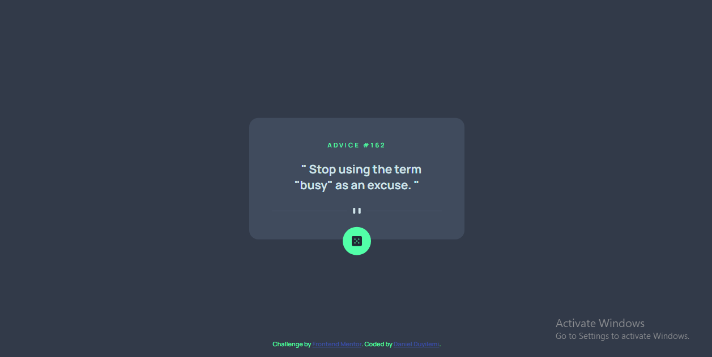

# Frontend Mentor - Advice generator app solution

This is a solution to the [Advice generator app challenge on Frontend Mentor](https://www.frontendmentor.io/challenges/advice-generator-app-QdUG-13db). Frontend Mentor challenges help you improve your coding skills by building realistic projects.

## Table of contents

- [The challenge](#the-challenge)
- [Screenshot](#screenshot)
- [Links](#links)
- [My process](#my-process)
  - [Built with](#built-with)
  - [What I learned](#what-i-learned)
  - [Continued development](#continued-development)
- [Author](#author)
- [Acknowledgments](#acknowledgments)

**Note: Delete this note and update the table of contents based on what sections you keep.**

### The challenge

Users should be able to:

- View the optimal layout for the content depending on their device's screen size
- See hover states for all interactive elements on the page
- Generate a new piece of advice by clicking the dice icon

### Screenshot

### Links

- Solution URL: [https://github.com/Catalyst497/Advice-generator.git]
- Live Site URL: [https://catalyst497.github.io/Advice-generator/]

### Built with

- Semantic HTML5 markup
- Flexbox
- Mobile-first workflow
- fetch API

### What I learned

I realised that I new just very little on APIs. Now, I will strart will to put in more effort into understanding APIs, routing, and asynchronous JS

### Continued development

- Grid Layout
- Flexbox
- React
- API

## Author

- Website - [Daniel Duyilemi](https://vast-falls-30673.herokuapp.com/)
- Frontend Mentor - [Daniel](https://www.frontendmentor.io/profile/Catalyst497)
- Twitter - [@Daniel43603607](https://twitter.com/Daniel43603607)

## Acknowledgments

This is me saying thank you to frontend mentor and everyone that works there for this awesome project. It was fairly simple but learnt a few new things from it.
